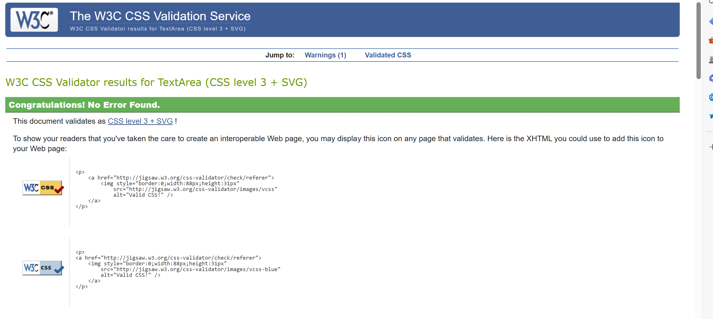
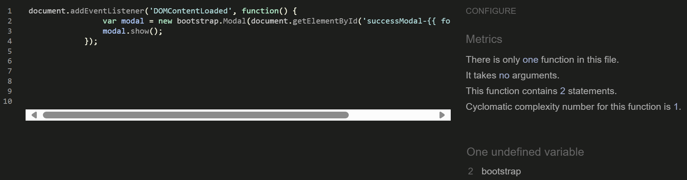

  # Testing

Return back to the [README.md](README.md) file.

- [Testing](#testing)
  * [Bugs Fixed](#bugs-fixed)
  * [Responsiveness Tests](#responsiveness-tests)
  * [Code Validation](#code-validation)
    + [HTML](#html)
    + [CSS](#css)
    + [JavaScript](#javascript)
    + [Python](#python)
  * [User Story Testing](#user-story-testing)
  * [Feature Testing](#feature-testing)
  * [Accessibility Testing](#accessibility-testing)
  * [Lighthouse Testing](#lighthouse-testing)
  * [Browser Testing](#browser-testing)

## Responsiveness Tests

To test the responsiveness, I have launched the website very early on. I followed the mobile-first strategy and verified all of my modifications using the DevTools browsers for Google Chrome and Microsoft Edge. Deployed versions were tested using the external website [Responsive Design Checker](https://responsivedesignchecker.com/ "Responsive Design Checker"). The [Am I Responsive](https://ui.dev/amiresponsive "Am I responsive") website was another external source that was used to obtain a unified view of different device breakpoints.

I have also used Google Chrome's Mobile Simulator extension to evaluate the responsiveness of even more specialized devices. Device samples were examined for navigation, element alignment, content layout, and functionality concerns at different breakpoints.

Final Test Results:

| Size | Device Example     | Navigation | Element Alignments | Content Placement | Functionality | Notes                             |
| ---- | ------------------ | ---------- | ------------------ | ----------------- | ------------- | --------------------------------- |
| sm   | Samsung Galaxy S20 | &check;    | &check;            | &check;           | &check;       |                                   |
| sm   | iPhone 11 PRO      | &check;    | &check;            | &check;           | &check;       |
| sm   | iPhone 13 PRO MAX  | &check;    | &check;            | &check;           | &check;       |
| md   | iPad MINI          | &check;    | &check;            | &check;           | &check;       |                                   |
| md   | Galaxy Tab S7      | &check;    | &check;            | &check;           | &check;       |                                   |
| md   | iPad Air           | &check;    | &check;            | &check;           | &check;       |                                   |
| lg   | iPad Pro           | &check;    | &check;            | &check;           | &check;       | Update About section image sizing |
| xl   | Mackbook Air       | &check;    | &check;            | &check;           | &check;       |                                   |
| xl   | HP Stream Laptop   | &check;    | &check;            | &check;           | &check;       |                                   |
| xxl  | Dell Lattitude     | &check;    | &check;            | &check;           | &check;       |                                   |
| xxl  | Desktop            | &check;    | &check;            | &check;           | &check;       |                                   |

[Back to top](#contents)

## Code Validation

### HTML

### CSS

The [W3C Jigsaw](https://jigsaw.w3.org/css-validator/) tool, provided by the W3C, enables to validate and verify the correctness of CSS code. It ensures that your web pages adhere to W3C standards, promoting interoperability and accessibility.

| **Tested** | **Result** | **View Result** | **Pass** |
--- | --- | --- | :---:
|CSS file | No errors |

Result Summary

| ✅

### JavaScript

No major errors were found when validating JavaScript through [Jshint](https://jshint.com/).

Jshint retruned one note that `bootstrap` variable is undefined. This can be ignored because `bootstrap.Modal` relies on bootstrap being a globally defined object, which Bootstrap itself provides.

Jshint

### Python

The python files have all been passed through [PEP8 CI Online](https://pep8ci.herokuapp.com/)

<b>PEP8 Test Results</b>

**settings.py:**

 

### Python (Unit Testing)

Python's `unittest` framework offers a robust and flexible testing solution. 
Ideally, every part of the project should be put through the robust automated testing. Due to time constraints I have utilized automated tests for Insights application concentrating on CRUD related functionality views, models and forms. 

The automated tests highlighted a redundant view and non existant html file. Although these issues did not affect the functionality of the application, the quality and maintainability of the code are equally important. 

## Manual Testing

In addition to using unittest, extensive manual testing was performed on the application. Each feature was verified against success criteria. Where applicable, negative testing was conducted by providing invalid or unexpected inputs to assess the application's robustness in handling errors and exceptions.

<b>Manual Testing Results</b>

**Profile**

| Test Case                   | Element                | Action                           | Success Criteria                                                                                                                   | Result |
| --------------------------- | ---------------------- | -------------------------------- | ---------------------------------------------------------------------------------------------------------------------------------- | ------ |
| Profile Picture Display     | Profile Picture        | View profile page                | If the user has a profile picture, it is displayed. If the user does not have a profile picture, a placeholder image is displayed. | ✅      |
| Insights Link               | Insights Button        | Click the Insights button        | The user is navigated to the insights page for the profile.                                                                        | ✅      |
| Drafts Link                 | Drafts Button          | Click the Drafts button          | The user is navigated to the drafts page for the profile. The drafts button is only visible to the profile owner.                  | ✅      |
| Favourites Link             | Favourites Button      | Click the Favourites button      | The user is navigated to the favourites page for the profile. The favourites button is only visible to the profile owner.          | ✅      |
| Profile Summary Information | Profile Summary        | View profile page                | The full name, location, bio, total likes, and total favourites are correctly displayed.                                           | ✅      |
| Profile Actions             | Update Profile Button  | Click the Update Profile button  | The user is navigated to the profile update page. This button is only visible to the profile owner.                                | ✅      |
| Profile Actions             | Change Password Button | Click the Change Password button | The user is navigated to the change password page. This button is only visible to the profile owner.                               | ✅      |
| Profile Actions             | Delete Account Button  | Click the Delete Account button  | The user is navigated to the account deletion page. This button is only visible to the profile owner.                              | ✅      |
| Invalid User Profile        | Profile Page           | Access invalid user profile      | Accessing a non-existent user profile returns a 404 error page.                                                                    | ✅      |
| Unauthorized Draft Access   | Drafts Button          | Access drafts as another user    | Viewing a public profile, there is no drafts option.                                                                               | ✅      |
| Unauthorized Delete Access  | Delete Account Button  | Access delete as another user    | Viewing a public profile, there is no delete account option.                                                                       | ✅      |
| Empty Profile Fields        | Profile Summary        | View profile page                | If any profile fields (e.g., location, bio) are empty, the page handles it gracefully without breaking.                            | ✅      |
| Likes Count                 | Profile Summary        | View user insights               | Likes count displayed matches likes on user insights.                                                                              | ✅      |
| Favourites Count            | Profile Summary        | View user insights               | Favourites count displayed matches favourites on user insights.                                                                    | ✅      |

**About Section**

| Test Case             | Element           | Action                     | Success Criteria                                                                                                                                       | Result |
| --------------------- | ----------------- | -------------------------- | ------------------------------------------------------------------------------------------------------------------------------------------------------ | ------ |
| About Profile Display | Developer Profile | View About page            |  Page displays first name, last name, location, languages, skills, and about section. If any field is missing, it handles gracefully without breaking. | ✅      |
| GitHub Link           | GitHub Icon       | Click GitHub icon          | The user is navigated to the developer's GitHub profile in a new tab. If the link is not provided, the icon is not visible.                            | ✅      |
| LinkedIn Link         | LinkedIn Icon     | Click LinkedIn icon        | The user is navigated to the developer's LinkedIn profile in a new tab. If the link is not provided, the icon is not visible.                          | ✅      |
| Resume Download       | Resume Icon       | Click Resume download icon | The user is able to download the developer's resume. If the link is not provided, the icon is not visible.                                             | ✅      |
| Email Link            | Email Icon        | Click Email icon           | The user is able to send an email to the developer.                                                                                                    | ✅      |
| Code Card             | Code Image/Card   | View About page            | The Code card with image, title, and description displays.                                                                                             | ✅      |
| Design Card           | Design Image/Card | View About page            | The Design card with image, title, and description displays.                                                                                           | ✅      |
| Education Section     | Education Card    | View About page            | The Education section displays with the provided education information. If education info is missing, it handles gracefully without breaking.          | ✅      |

**Insight List**

| Test Case              | Element              | Action                                             | Success Criteria                                                                                       | Result |
| ---------------------- | -------------------- | -------------------------------------------------- | ------------------------------------------------------------------------------------------------------ | ------ |
| Sidebar Display        | Sidebar              | View Insights List page                            | The category sidebar is displayed correctly.                                                           | ✅      |
| Search Results Heading | Search Results       | Search for a term                                  | The heading displays "Search Results for: [search_term]".                                              | ✅      |
| Category Heading       | Category Heading     | Select a category                                  | The heading displays "Posts in Category: [category_name]".                                             | ✅      |
| Browse All Heading     | All Insights Heading | View Insights List page without search or category | The heading displays "Browse All Insights".                                                            | ✅      |
| No Insights Message    | No Insights Message  | View Insights List page with no insights           | The message "Nothing found .... Feel free to add an Insight." is displayed when there are no insights. | ✅      |
| Pagination Display     | Pagination           | View Insights List page                            | The pagination component is displayed correctly, allowing navigation through insights.                 | ✅      |

**Manage Insights**

| Test Case                                              | Element                                                                   | Action                                                     | Success Criteria                                                                                    | Result | Notes                                                                            |
| ------------------------------------------------------ | ------------------------------------------------------------------------- | ---------------------------------------------------------- | --------------------------------------------------------------------------------------------------- | ------ | -------------------------------------------------------------------------------- |
| Load page with user as Superuser                       | Page title, message for Superuser, form, Submit button, Cancel button     | Verify page loads correctly                                | Page title "Add Insight" displayed, Superuser message displayed, form rendered, buttons present     | ✅      |                                                                                  |
| Load page with user as non-Superuser                   | Page title, message for non-Superuser, form, Submit button, Cancel button | Verify page loads correctly                                | Page title "Add Insight" displayed, non-Superuser message displayed, form rendered, buttons present | ✅      |                                                                                  |
| Insight Add - Submit form with valid data              | Form submission                                                           | Fill form with valid data and submit                       | Insight successfully added, confirmation message displayed or redirected to success page            | ✅      |                                                                                  |
| Insight Add - Submit form with invalid data            | Form validation error messages, form retains entered data                 | Fill form with invalid data and submit                     | Validation errors displayed, form retains previously entered data                                   | ✅      |                                                                                  |
| Insight Add - Click "Cancel" button                    | Cancel button redirection, no changes to current state                    | Click on "Cancel" button                                   | Redirected to home page                                                                             | ✅      |                                                                                  |
| Load page with post featuring actual image             | Featured image, conditional rendering                                     | Access page with a post featuring an actual image          | Actual post image displayed with correct URL                                                        | ✅      |                                                                                  |
| Load page with post featuring placeholder image        | Featured image, conditional rendering                                     | Access page with a post featuring a placeholder image      | Placeholder image displayed with correct URL                                                        | ✅      |                                                                                  |
| Load page as author with edit/delete buttons           | Author section, edit/delete buttons                                       | Access page as the author of the post                      | Author's profile picture displayed correctly, edit/delete buttons visible                           | ✅      |                                                                                  |
| Load page as superuser with edit/delete buttons        | Author section, edit/delete buttons                                       | Access page as a superuser                                 | Edit/delete buttons visible and functional for the post                                             | ✅      |                                                                                  |
| Load page with post status 0 (awaiting admin approval) | Status message                                                            | Access page with a post status 0 (awaiting admin approval) | Message "This Post is waiting for admin approval." displayed                                        | ✅      |                                                                                  |
| Load page with post status 2 (draft)                   | Status message                                                            | Access page with a post status 2 (draft)                   | Message "This Post is a draft." displayed                                                           | ✅      |                                                                                  |
| Load page with post status 1 (posted)                  | Like, favorite, comment count sections                                    | Access page with a post status 1 (posted)                  | Like, favorite, and comment count sections displayed                                                | ✅      |                                                                                  |
| Category Hyperlink                                     | Category name on Insight card                                             | Click on Category name                                     | All posts within the Category are displayed                                                         | ✅      |                                                                                  |
| Author Username Hyperlink                              | Author Username on Insight card                                           | Click on Username                                          | User public profile is displayed                                                                    | ✅      |                                                                                  |
| Insight Delete Notification                            | Delete Button                                                             | Click on button                                            | Notification displayed with warning and insight title. Cancel button return to current page.        | ✅      |                                                                                  |
| Insight Edit - Submit form with valid data             | Form submission                                                           | Fill form with valid data and submit                       | Insight successfully added, confirmation message displayed or redirected to success page            | ✅      |                                                                                  |
| Insight Edit - Submit form with invalid data           | Form validation error messages, form retains entered data                 | Fill form with invalid data and submit                     | Validation errors displayed, form retains previously entered data                                   | ✅      |                                                                                  |
| Insight Edit - Click "Cancel" button                   | Cancel button redirection, no changes to current state                    | Click on "Cancel" button                                   | Redirected to home page, no changes to data or state                                                | ✅      |                                                                                  |
| Like a post                                            | Like icon                                                                 | Click on like button                                       | Like count increments by 1, success message displayed. Like icon fills.                             | ✅      | The fa 👍and 💗icons transform only in insight detail view. Issue added to bugs. |
| Unlike a post                                          | Like icon                                                                 | Click on like button (already liked)                       | Like count decrements by 1, success message displayed. Like icon empty                              | ✅      |
| Favourite a post                                       | Favourite icon                                                            | Click on favourite button                                  | Favourite count increments by 1, success message displayed. Heart icon fills.                       | ✅      |
| Unfavourite a post                                     | Favourite icon                                                            | Click on favourite button (already favourited)             | Favourite count decrements by 1, success message displayed. Heart icon empty                        | ✅      |

**Comments**

| Test Case                           | Element                          | Action                          | Expected Outcome                                                                                  | Result | Notes                                                                  |
| ----------------------------------- | -------------------------------- | ------------------------------- | ------------------------------------------------------------------------------------------------- | ------ | ---------------------------------------------------------------------- |
| Display Comments                    | Comments container               | View existing comments          | All comments associated with the post are displayed, showing author's username and creation time. | ✅      |                                                                        |
| Display Default Profile Picture     | Comment author's profile picture | Author has no profile picture   | Default profile picture (placeholder) is displayed next to the comment.                           | ✅      |                                                                        |
| Display Actual Profile Picture      | Comment author's profile picture | Author has a profile picture    | Author's actual profile picture is displayed next to the comment.                                 | ✅      |                                                                        |
| Display Comment Timestamp           | Comment timestamp                | View comment creation time      | Comment creation time is displayed in a human-readable format (e.g., "2 days ago").               | ✅      |                                                                        |
| Edit Comment (Owner or Superuser)   | Edit button                      | Click on edit button            | Redirects to edit comment page if user is comment owner or superuser.                             | ✅      |                                                                        |
| Delete Comment (Owner or Superuser) | Delete button                    | Click on delete button          | Shows delete confirmation modal and deletes comment if user confirms action.                      | ✅      |                                                                        |
| No Comments Available               | "No comments yet" message        | No comments exist for the post  | Message "No comments yet." is displayed.                                                          | ✅      |                                                                        |
| Submit Comment                      | Comment form                     | Enter comment and submit        | Comment is successfully added and displayed in the comments section.                              | ✅      | The comment form has no max characters. Recorded in Bugs and Resolved. |
| Authenticate Comment Submission     | "Posting as" message             | User is authenticated           | Shows message "Posting as: [username]" above the comment form.                                    | ✅      |                                                                        |
| Display Login Prompt                | "Log in" link                    | User is not authenticated       | Shows link "Log in to leave a comment" prompting user to log in.                                  | ✅      |                                                                        |
| Form Validation Error               | Submit button                    | Submit empty or invalid comment | Displays error messages next to form fields, prompting user to correct them.                      | ✅      |                                                                        |
| Display Comment Count               | Comment section                  | Add a comment                   | Comment count increments accordingly                                                              | ✅      |                                                                        |

**Landing Page**

| Test Case                            | Element                       | Action                                                             | Success Criteria                                                                                                                                                       | Result |
| ------------------------------------ | ----------------------------- | ------------------------------------------------------------------ | ---------------------------------------------------------------------------------------------------------------------------------------------------------------------- | ------ |
| Verify Active State for Nav Links    | Navigation link               | Load every page that includes the navigation bar.                  | The link in the navigation bar should have the active class when on the page.                                                                                          | ✅      |
| Verify Conditional Button Display    | Conditional Button Display    | Check if user is authenticated and not authenticated.              | Displays "Add your Insight" button linked to add-insight for authenticated users. - Displays "Join Us" button linked to account_signup for non-authenticated users. | ✅      |
| Verify Conditional Button Display    | Conditional Button Display    | Check if user is superuser and not authenticated.                  | Displays "Pending Insights" button for superusers only.                                                                                                                | ✅      |
| Verify Latest Insights Section       | Latest Insights Section       | Check if latest insights are displayed in latest_insights loop.    | Each post in latest_insights displays correctly                                                                                                                        | ✅      |
| Verify Most Popular Insights Section | Most Popular Insights Section | Check if most popular insights are displayed in most_popular loop. | Each post in most_popular displays with title linked to insight-details and author linked to profile.                                                                  | ✅      |
| Verify "More Insights" Link          | "More Insights" Link          | Click on "More Insights" button/link.                              | Redirects to Insights page.                                                                                                                                            | ✅      |
| Verify Contact Form Display          | Contact Form                  | Load the contact page.                                             | Contact form (contact-form) is displayed with appropriate fields                                                                                                       | ✅      |
| Verify Form Submission               | Form Submission               | Submit the contact form with valid data.                           | Form submits successfully, and the message "Send Message" button triggers a form submission.                                                                           | ✅      |
| Verify Error Handling                | Error Handling                | Submit the contact form with invalid data.                         | Form does not submit, and appropriate validation errors are displayed.                                                                                                 | ✅      |
| Verify Contact Form Receipt          | Success Submission            | Submit the contact form with valid data.                           | Contact appears in Django Admin Portal                                                                                                                                 | ✅      |

**User Access**

| Test Case                       | Element                                       | Action                                                                            | Success Criteria                                                                                                                                                                                  | Result |
| ------------------------------- | --------------------------------------------- | --------------------------------------------------------------------------------- | ------------------------------------------------------------------------------------------------------------------------------------------------------------------------------------------------- | ------ |
| Register with Valid Credentials | Registration form fields (username, password) | Fill out the form with valid credentials and submit.                              | User is redirected to the home page after successful registration and is logged in.                                                                                                               | ✅      |
| Register with Existing Username | Registration form fields (username, password) | Attempt to register with a username that already exists.                          | Registration fails with appropriate error message ("Username already exists"). User remains on the registration page.                                                                             | ✅      |
| Register with Weak Password     | Registration form fields (username, password) | Fill out the form with a weak password and submit.                                | Registration fails with appropriate error message ("Password must be stronger"). User remains on the registration page.                                                                           | ✅      |
| Register with Blank Fields      | Registration form fields (username, password) | Leave one or both required fields (username, password) blank and submit the form. | Registration fails with appropriate error messages for each blank field. User remains on the registration page.                                                                                   | ✅      |
| Login with Valid Credentials    | Login form fields (username, password)        | Fill out the form with valid username and password and submit.                    | User is redirected to the home page after successful login. Success message displayed with username.                                                                                              | ✅      |
| Login with Invalid Username     | Login form fields (username, password)        | Attempt to login with an invalid username.                                        | Login fails with appropriate error message ("Please enter a correct username and password"). User remains on the login page.                                                                      | ✅      |
| Login with Incorrect Password   | Login form fields (username, password)        | Attempt to login with a valid username but incorrect password.                    | Login fails with appropriate error message ("Please enter a correct username and password"). User remains on the login page.                                                                      | ✅      |
| Login with Blank Fields         | Login form fields (username, password)        | Leave username or password field blank and submit the form.                       | Login fails with appropriate error messages for each blank field. User remains on the login page.                                                                                                 | ✅      |
| Logout                          | Logout link or button                         | Click on the logout link/button while authenticated.                              | User is logged out and redirected to the home page. Navigation bar updates to reflect non-authenticated state (e.g., "Login" and "Register" links). Log out notification displayed with username. | ✅      |

**Superuser Insight Admin**

| Test Case                      | Element                        | Action                                                   | Expected Outcome                                                                                           | Result |
| ------------------------------ | ------------------------------ | -------------------------------------------------------- | ---------------------------------------------------------------------------------------------------------- | ------ |
| Display Pending Approvals      | Table header and pending posts | Access the page containing pending posts.                | Pending posts table should display with columns for Author, Title, Date, and Action buttons.               | ✅      |
| Admin Instructions Visibility  | Admin note list                | Read the instructions provided for admins.               | Instructions are visible and list details on how to approve, view, delete, edit, and manage pending posts. | ✅      |
| View Post Details              | Post title link                | Click on a post title link.                              | Navigate to the details page of the selected post.                                                         | ✅      |
| Approve Post                   | Approve button                 | Click on the 'Approve' button for a pending post.        | Post status changes to 'Published' or 'Approved'.                                                          | ✅      |
| Edit Post (Manual Action)      | Edit button                    | Click on the 'Edit' button for a pending post.           | Navigate to the edit page for the selected post.                                                           | ✅      |
| Delete Post (Manual Action)    | Delete button                  | Click on the 'Delete' button for a pending post.         | Post is deleted from the system.                                                                           | ✅      |
| Save to Drafts (Manual Action) | Save to drafts button          | Click on the 'Save to drafts' button for a pending post. | Post status changes to 'Draft' and is not displayed in pending approvals.                                  | ✅      |
| Empty State (No Pending Posts) | Display message                | Verify when there are no pending posts.                  | Display message indicating 'No posts pending approval'.                                                    | ✅      |
| Security - CSRF Token          | Form submission                | Submit any form (e.g., approve, edit, delete).           | Form submission succeeds without CSRF token errors.                                                        | ✅      |

**User Messages**

| Test Case                                             | Element                                   | Action                                            | Success Criteria                                                                                                               | Result |
| ----------------------------------------------------- | ----------------------------------------- | ------------------------------------------------- | ------------------------------------------------------------------------------------------------------------------------------ | ------ |
| Profile Update Success                                | Profile Update Form                       | Submit valid update form                          | A success message "Profile has been updated" should be displayed after updating the profile successfully.                      | ✅      |
| Profile Delete Success                                | Delete Profile Button                     | Confirm profile deletion                          | A success message "Your profile has been successfully deleted." should be displayed after the profile is deleted successfully. | ✅      |
| Change Password Success                               | Change Password Form                      | Submit valid password form                        | A success message confirming the password change should be displayed.                                                          | ✅      |
| Draft Save Success                                    | Draft Save Button                         | Save a draft                                      | A success message confirming that the draft has been saved should be displayed.                                                | ✅      |
| Favourite Add Success                                 | Favourite Button                          | Add a post to favourites                          | A success message confirming that the post has been added to favourites should be displayed.                                   | ✅      |
| Favourite Remove Success                              | Favourite Button                          | Remove a post from favourites                     | A success message confirming that the post has been removed from favourites should be displayed.                               | ✅      |
| Change Password Mismatch                              | Change Password Form                      | Submit non-matching passwords                     | An error message indicating password mismatch should be displayed.                                                             | ✅      |
| Invalid Draft Save                                    | Draft Save Button                         | Submit an invalid draft                           | An error message indicating the reason for invalid draft save should be displayed.                                             | ✅      |
| Add Favourite Unauthorized                            | Favourite Button                          | Try to add favourite without login                | User brought to login page                                                                                                     | ✅      |
| Form Validation Error                                 | Any Form                                  | Submit incomplete form                            | An error message indicating required fields should be displayed.                                                               | ✅      |
| Server Error (500)                                    | Any Action                                | Trigger a server error                            | A generic server error message should be displayed.                                                                            | ✅      |
| Page Not Found (404)                                  | URL Navigation                            | Navigate to non-existent page                     | A page not found message should be displayed.                                                                                  | ✅      |
| CSRF Verification Failed (403)                        | Any Form                                  | Submit form with invalid CSRF token               | A CSRF verification failed message should be displayed.                                                                        | ✅      |
| Submit Insight form with status 0 (awaiting approval) | Success message displayed based on status | Fill form and set status to 0 (awaiting approval) | "Insight added successfully! Waiting for Admin approval." message displayed, redirected to home page                           | ✅      |
| Submit Insight form with status 2 (draft)             | Success message displayed based on status | Fill form and set status to 2 (draft)             | "Insight added to drafts successfully." message displayed, redirected to home page                                             | ✅      |
| Submit Insight form with status 1 (posted)            | Success message displayed based on status | Fill form and set status to 1 (posted)            | "Insight posted successfully." message displayed, redirected to home page                                                      | ✅      |
| nsight updated successfully                           | Submit button                             | Update insight details and submit form            | Success message "Insight was edited successfully" displayed                                                                    | ✅      |
| Invalid form submission                               | Submit button                             | Submit form with invalid data                     | Error message "Try Again. Please check all fields." displayed                                                                  | ✅      |
| Like a post                                           | Like button                               | Click on like button                              | Success message "Thank You for Liking!" displayed                                                                              | ✅      |
| Unlike a post                                         | Like button                               | Click on like button (already liked)              | Success message "Insight Unliked!" displayed                                                                                   | ✅      |
| Add to favourites                                     | Favourite button                          | Click on favourite button                         | Success message "Insight Added to Favourites List!" displayed                                                                  | ✅      |
| Remove from favourites                                | Favourite button                          | Click on favourite button (already favourited)    | Success message "Insight Removed from Favourites" displayed                                                                    | ✅      |
| Delete insight                                        | Delete button                             | Click on delete button                            | Success message "Insight removed successfully" displayed                                                                       | ✅      |
| Add Comment                                           | Comment form, Submit button               | Submit a valid comment                            | Success message "Comment created successfully!" displayed                                                                      | ✅      |
| Invalid Comment Submission                            | Comment form, Submit button               | Submit an empty comment                           | Error message "There was an error. Please try again!" displayed                                                                | ✅      |
| Edit Comment                                          | Edit button                               | Edit an existing comment                          | Success message "Comment updated successfully" displayed                                                                       | ✅      |
| Delete Comment                                        | Delete button                             | Delete an existing comment                        | Success message "Comment removed successfully" displayed                                                                       | ✅      |

 

## Role-based Restrictions

The user role based restrictions were tested to ensure that view and functionality reflects the scope of the project.

| Admin                                             | Test Pass |
| ------------------------------------------------- | --------- |
| Full access to all resources and features.        | ✅         |
| Can create, read, update, and delete any content. | ✅         |
| Can manage user roles and permissions.            | ✅         |
| Access to admin dashboard and settings.           | ✅         |
| Can publish content without approval.             | ✅         |

| Registered User                                         | Test Pass |
| ------------------------------------------------------- | --------- |
| Can create, read, update, and delete their own content. | ✅         |
| Cannot manage content created by other users.           | ✅         |
| Can create and manage their own comments.               | ✅         |
| Can like and favorite posts.                            | ✅         |

| Visitor                                       | Test Pass |
| --------------------------------------------- | --------- |
| Can only read publicly available content.     | ✅         |
| Cannot create, update, or delete any content. | ✅         |
| Cannot manage comments, likes, or favorites.  | ✅         |

## Bugs Fixed

## Browser Compatibility

The deployed project was tested on the most popular browsers for compatibility issues.
No major issues identified. 

[Browser Testing Results](/docs/testing-md/browser-testing.pdf)

## User Story Testing

**Developer User Stories**

| User Story                                                                                                     | Acceptance Criteria Complete | Notes                                                                                                            |
| -------------------------------------------------------------------------------------------------------------- | ---------------------------- | ---------------------------------------------------------------------------------------------------------------- |
| [Adopt Agile Methodology](https://github.com/Indre-V/blossom-therapy/issues/9#issue-2302892613)                | ✅                            | Documented in README.md                                                                                          |
| [Design Database Schema](https://github.com/Indre-V/blossom-therapy/issues/10#issue-2302944970)                | ✅                            | Database design documented in README.md                                                                          |
| [Create Wireframes](https://github.com/Indre-V/blossom-therapy/issues/11#issue-2302950413)                     | ✅                            | Wireframes documented in README.md                                                                               |
| [Design Visuals](https://github.com/Indre-V/blossom-therapy/issues/12#issue-2303047004)                        | ✅                            | Design process documented in README.md                                                                           |
| [Create Django Project](https://github.com/Indre-V/blossom-therapy/issues/14#issue-2303105943)                 | ✅                            | Git commit [548ffe2](https://github.com/Indre-V/blossom-therapy/commit/548ffe2c2b877163958e9e8c22e90f9ed1afc997) |
| [Initial Deployment to Heroku](https://github.com/Indre-V/blossom-therapy/issues/15#issue-2303122957)          | ✅                            | Git commit [8c7d0f4](https://github.com/Indre-V/blossom-therapy/commit/8c7d0f44072c5897084b06c738a39a6eed9f4037) |
| [Update Developer Profile](https://github.com/Indre-V/blossom-therapy/issues/51#issue-2308275825)              | ✅                            | Available in Django Admin Panel                                                                                  |
| [Performance Optimization](https://github.com/Indre-V/blossom-therapy/issues/41#issue-2304290974)              | ✅                            | Results documented in testing-md                                                                                 |
| [Code Validation](https://github.com/Indre-V/blossom-therapy/issues/44#issue-2304298110)                       | ✅                            | Results documented in testing-md                                                                                 |
| [Comprehensive Project Documentation](https://github.com/Indre-V/blossom-therapy/issues/45#issue-2304301021)   | ✅                            | Comprehensive README.md and testing-md                                                                           |
| [User Story Testing](https://github.com/Indre-V/blossom-therapy/issues/46#issue-2304303369)                    | ✅                            | Results documented in testing-md                                                                                 |
| [Heroku Deployment](https://github.com/Indre-V/blossom-therapy/issues/47#issue-2304304912)                     | ✅                            | Git commit [23f1988](https://github.com/Indre-V/blossom-therapy/commit/23f1988a49387c9e13add7e08afa4e5b6769dc7c) |
| [Performance and Accessibility Testing](https://github.com/Indre-V/blossom-therapy/issues/48#issue-2304308035) | ✅                            | Results documented in testing-md                                                                                 |

**Visitor User Stories**

| User Story                                                                                                        | Acceptance Criteria Complete | Screenshot/Notes                                                                                                |
| ----------------------------------------------------------------------------------------------------------------- | ---------------------------- | --------------------------------------------------------------------------------------------------------------- |
| [User Registration](https://github.com/Indre-V/blossom-therapy/issues/17#issue-2303311873)                        | ✅                            |  

Screenshot

     |
| [Display Filter](https://github.com/Indre-V/blossom-therapy/issues/37#issue-2304284083)                           | ✅                            |  

Screenshot

             |
| [View Developer Profile](https://github.com/Indre-V/blossom-therapy/issues/50#issue-2308263786)                   | ✅                            |  

Screenshot

               |
| [Access Developer's Resume](https://github.com/Indre-V/blossom-therapy/issues/52#issue-2308280758)                | ✅                            |  

Screenshot

           |
| [Navigate to Developer's GitHub Portfolio](https://github.com/Indre-V/blossom-therapy/issues/53#issue-2308294861) | ✅                            |  

Screenshot

 |
| [Implement Navigation Experience](https://github.com/Indre-V/blossom-therapy/issues/38#issue-2304286025)          | ✅                            | Summary documented in README.md                                                                                 |
| [Visual Consistency](https://github.com/Indre-V/blossom-therapy/issues/39#issue-2304287983)                       | ✅                            | Summary documented in README.md                                                                                 |
| [Accessibility Enhancement](https://github.com/Indre-V/blossom-therapy/issues/40#issue-2304289636)                | ✅                            | Test results documented in testing-md                                                                           |
| [Developer Feedback and Support](https://github.com/Indre-V/blossom-therapy/issues/34#issue-2304132868)           | ✅                            |  

Screenshot

 |

**Registered User Stories**

| User Story                                                                                                   | Acceptance Criteria Complete | Screenshot                                                                                                              |
| ------------------------------------------------------------------------------------------------------------ | ---------------------------- | ----------------------------------------------------------------------------------------------------------------------- |
| [User Login and Logout Functionality](https://github.com/Indre-V/blossom-therapy/issues/18#issue-2303341463) | ✅                            |  

Screenshot

                         |
| [Password Reset](https://github.com/Indre-V/blossom-therapy/issues/19#issue-2303364772)                      | ✅                            |  

Screenshot

     |
| [Profile Management](https://github.com/Indre-V/blossom-therapy/issues/20#issue-2303381892)                  | ✅                            |  

Screenshot

              |
| [Create New Insight](https://github.com/Indre-V/blossom-therapy/issues/22#issue-2304082436)                  | ✅                            |  

Screenshot

           |
| [Manage Insight](https://github.com/Indre-V/blossom-therapy/issues/23#issue-2304088784)                      | ✅                            |  

Screenshot

     |
| [Add a Comment](https://github.com/Indre-V/blossom-therapy/issues/24#issue-2304095247)                       | ✅                            |  

Screenshot

           |
| [Manage Comments](https://github.com/Indre-V/blossom-therapy/issues/25#issue-2304099460)                     | ✅                            |  

Screenshot

     |
| [User Interaction with Posts](https://github.com/Indre-V/blossom-therapy/issues/29#issue-2304113934)         | ✅                            |  

Screenshot

 |
 

**Admin User Stories**

| User Story                                                                                           | Acceptance Criteria Complete | Notes                                                                                                                                                                                                              |
| ---------------------------------------------------------------------------------------------------- | ---------------------------- | ------------------------------------------------------------------------------------------------------------------------------------------------------------------------------------------------------------------ |
| [User Content Approvals](https://github.com/Indre-V/blossom-therapy/issues/28#issue-2304109153)      | ✅                            | Comments can be edited and deleted by admin in front end. The same functionality is available in backend admin panel as well. There is an extra tab for superusers in navigation to view and manage pending posts. |
| [Administration Content CRUD](https://github.com/Indre-V/blossom-therapy/issues/27#issue-2304105029) | ✅                            | Superusers can manage user profiles via admin portal. Insights and Comments can also be managed in front and backend. Admin users have an extra option to post insights without requiring an approval.             |

## Lighthouse Testing

Blossom-Therapy was tested in the [Chrome Dev Tools](https://developer.chrome.com/docs/devtools/) and [Microsoft Edge Dev Tools](https://docs.microsoft.com/en-us/microsoft-edge/devtools-guide-chromium/open/?tabs=cmd-Windows) using Lighthouse Testing tool which inspects and scores the website for the following criteria:

* Performance - how quickly a website loads and how quickly users can access it.
* Accessibility - test analyses how well people who use assistive technologies can use your website.
* Best Practices - checks whether the page is built on the modern standards of web development.
* SEO - checks if the website is optimised for search engine result rankings.

Initial Lighthouse tests returned accessibility error *Background and foreground colors do not have a sufficient contrast ratio.*. This was due to the button font in the Profile Section. Once the font was updated, the Accessibility score returned 100.

All images were compressed and converted to .webp using [tiny.png](https://tinypng.com/) to improve performance scores. Website was tested with extra content to replicate real life scenario.
Performance results on mobile were on a lower side due to Heroku and Cloudinary speed issues. Due to time constraints the retest of mobile performance could not be carried out.

<b>Lighthouse Test Results</b>

| Page                 | Status          | Size    | Screenshot                                                                     | Notes                                                  |
| -------------------- | --------------- | ------- | ------------------------------------------------------------------------------ | ------------------------------------------------------ |
| Home                 | Visitor         | Desktop |         |                                                        |
| Home                 | Registered User | Desktop |          |                                                        |
| Home                 | Visitor         | Mobile  |          |                                                        |
| Home                 | Registered User | Mobile  |           |                                                        |
| Insights             | Visitor         | Desktop |        |                                                        |
| Insights             | Registered User | Desktop |       |                                                        |
| Insights             | Visitor         | Mobile  |         |                                                        |
| Insights             | Registered User | Mobile  |        |                                                        |
| Add Insight          | Registered User | Mobile  |     |                                                        |
| Add Insight          | Registered User | Desktop |    |                                                        |
| Pending Approvals    | Registered User | Mobile  |         |                                                        |
| Pending Approvals    | Registered User | Desktop |        |                                                        |
| Profile - private    | Registered User | Mobile  |         |                                                        |
| Profile - private    | Registered User | Desktop |        |                                                        |
| Profile - public     | Visitor         | Mobile  |   |                                                        |
| Profile - public     | Visitor         | Desktop |     |                                                        |
| Profile - public     | Registered User | Mobile  |     |                                                        |
| Profile - public     | Registered User | Desktop |            |                                                        |
| Profile - Insights   | Visitor         | Mobile  |    |                                                        |
| Profile - Insights   | Visitor         | Desktop |           |                                                        |
| Profile - Insights   | Registered User | Desktop |          |                                                        |
| Profile - Drafts     | Registered User | Desktop |            |                                                        |
| Profile - Drafts     | Registered User | Mobile  |     |                                                        |
| Profile - Favourites | Registered User | Desktop |      |                                                        |
| Profile - Favourites | Registered User | Mobile  |       |                                                        |
| Profile - Update     | Registered User | Desktop |             |                                                        |
| Profile - Update     | Registered User | Mobile  |              |                                                        |
| Change-Password      | Registered User | Desktop |             |                                                        |
| Change-Password      | Registered User | Mobile  |              | Accessibility score of 96 due to button contrast.      |
| Delete-Account       | Registered User | Desktop |                 |                                                        |
| Delete-Account       | Registered User | Mobile  |                  | Accessibility score of 95 due to button contrast.      |
| Insights-Detail      | Registered User | Desktop |  |                                                        |
| Insights-Detail      | Registered User | Mobile  |   |                                                        |
| Insights-Detail      | Visitor         | Desktop |    |                                                        |
| Insights-Detail      | Visitor         | Mobile  |     |                                                        |
| Edit-Comment         | Registered User | Desktop |   |                                                        |
| Edit-Comment         | Registered User | Mobile  |    |                                                        |
| Contact-Form         | Visitor         | Mobile  |          |                                                        |
| Contact-Form         | Registered User | Mobile  |         |                                                        |
| Contact-Form         | Visitor         | Desktop |         |                                                        |
| Contact-Form         | Registered User | Desktop |        |                                                        |
| About                | Visitor         | Desktop |           |                                                        |
| About                | Registered User | Desktop |          |                                                        |
| About                | Visitor         | Mobile  |            | Very poor scores returned so removed dev profile image |
| About                | Registered User | Mobile  |           |                                                        |
| Search-Results       | Visitor         | Desktop |          |                                                        |
| Search-Results       | Registered User | Desktop |         |                                                        |
| Search-Results       | Visitor         | Mobile  |           |                                                        |
| Search-Results       | Registered User | Mobile  |          |                                                        |
| Category-filter      | Visitor         | Desktop |      |                                                        |
| Category-filter      | Registered User | Desktop |     |                                                        |
| Category-filter      | Visitor         | Mobile  |         |                                                        |
| Category-filter      | Registered User | Mobile  |        |                                                        |

 

[Back to top](#contents)

## Accessibility Testing

[WAVE](https://wave.webaim.org/) online tool was used to check terminal colour contrast.

While building the application, the general principles of accessibility where adhered to: 

- Using clear instructions
- Asking for user input before continuing
- Validating inputs before moving on to the next step
- Testing the game to make sure it does not crash from user input
- Using ARIA labels in the README

