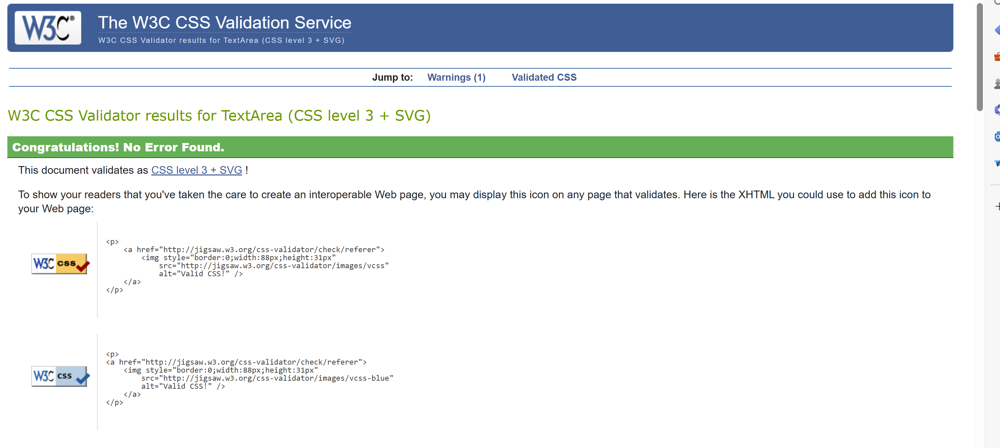
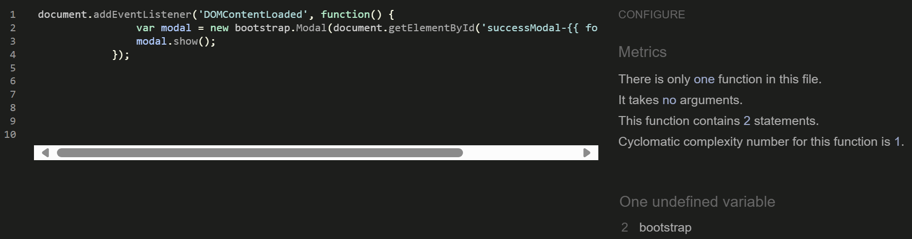

  # Testing

Return back to the [README.md](README.md) file.

- [Testing](#testing)
  * [Bugs Fixed](#bugs-fixed)
  * [Responsiveness Tests](#responsiveness-tests)
  * [Code Validation](#code-validation)
    + [HTML](#html)
    + [CSS](#css)
    + [JavaScript](#javascript)
    + [Python](#python)
  * [User Story Testing](#user-story-testing)
  * [Feature Testing](#feature-testing)
  * [Accessibility Testing](#accessibility-testing)
  * [Lighthouse Testing](#lighthouse-testing)
  * [Browser Testing](#browser-testing)

## Responsiveness Tests

To test the responsiveness, I have launched the website very early on. I followed the mobile-first strategy and verified all of my modifications using the DevTools browsers for Google Chrome and Microsoft Edge. Deployed versions were tested using the external website [Responsive Design Checker](https://responsivedesignchecker.com/ "Responsive Design Checker"). The [Am I Responsive](https://ui.dev/amiresponsive "Am I responsive") website was another external source that was used to obtain a unified view of different device breakpoints.

I have also used Google Chrome's Mobile Simulator extension to evaluate the responsiveness of even more specialized devices. Device samples were examined for navigation, element alignment, content layout, and functionality concerns at different breakpoints.

Final Test Results:

| Size | Device Example     | Navigation | Element Alignments | Content Placement | Functionality | Notes                             |
| ---- | ------------------ | ---------- | ------------------ | ----------------- | ------------- | --------------------------------- |
| sm   | Samsung Galaxy S20 | &check;    | &check;            | &check;           | &check;       |                                   |
| sm   | iPhone 11 PRO      | &check;    | &check;            | &check;           | &check;       |
| sm   | iPhone 13 PRO MAX  | &check;    | &check;            | &check;           | &check;       |
| md   | iPad MINI          | &check;    | &check;            | &check;           | &check;       |                                   |
| md   | Galaxy Tab S7      | &check;    | &check;            | &check;           | &check;       |                                   |
| md   | iPad Air           | &check;    | &check;            | &check;           | &check;       |                                   |
| lg   | iPad Pro           | &check;    | &check;            | &check;           | &check;       | Update About section image sizing |
| xl   | Mackbook Air       | &check;    | &check;            | &check;           | &check;       |                                   |
| xl   | HP Stream Laptop   | &check;    | &check;            | &check;           | &check;       |                                   |
| xxl  | Dell Lattitude     | &check;    | &check;            | &check;           | &check;       |                                   |
| xxl  | Desktop            | &check;    | &check;            | &check;           | &check;       |                                   |

[Back to top](#contents)

## Code Validation

### HTML

### CSS

The [W3C Jigsaw](https://jigsaw.w3.org/css-validator/) tool, provided by the W3C, enables to validate and verify the correctness of CSS code. It ensures that your web pages adhere to W3C standards, promoting interoperability and accessibility.

| **Tested** | **Result** | **View Result** | **Pass** |
--- | --- | --- | :---:
|CSS file | No errors |

Result Summary

| ✅

### JavaScript

No major errors were found when validating JavaScript through [Jshint](https://jshint.com/).

Jshint retruned one note that `bootstrap` variable is undefined. This can be ignored because `bootstrap.Modal` relies on bootstrap being a globally defined object, which Bootstrap itself provides.

Jshint

### Python

The python files have all been passed through [PEP8 CI Online](https://pep8ci.herokuapp.com/)

<b>PEP8 Test Results</b>

**settings.py:**

 

## Automated Testing

A number of automated tests were carried out.

-higher application quality
-easier refactoring
-easier version upgrades

### Python (Unit Testing)

I have used Django's built-in unit testing framework to test the application functionality.

In order to run the tests, I ran the following command in the terminal:

`python manage.py test`

## Defensive Programming Testing

Defensive programming testing involves verifying that the defensive measures implemented in the code are effective. 

- Negative Testing: Provide invalid or unexpected inputs to the application to see how well it handles errors and exceptions.

## Role-based Restrictions

The user role based restrictions were tested to ensure that view and functionality reflects the scope of the project.

| Admin                                             | Test Pass |
| ------------------------------------------------- | --------- |
| Full access to all resources and features.        | ✅         |
| Can create, read, update, and delete any content. | ✅         |
| Can manage user roles and permissions.            | ✅         |
| Access to admin dashboard and settings.           | ✅         |
| Can publish content without approval.             | ✅         |

| Registered User                                         | Test Pass |
| ------------------------------------------------------- | --------- |
| Can create, read, update, and delete their own content. | ✅         |
| Cannot manage content created by other users.           | ✅         |
| Can create and manage their own comments.               | ✅         |
| Can like and favorite posts.                            | ✅         |

| Visitor                                       | Test Pass |
| --------------------------------------------- | --------- |
| Can only read publicly available content.     | ✅         |
| Cannot create, update, or delete any content. | ✅         |
| Cannot manage comments, likes, or favorites.  | ✅         |

## Bugs Fixed

## Browser Compatibility

The deployed project was tested on the most popular browsers for compatibility issues.
No major issues identified. 

[Browser Testing Results](/docs/testing.md/browser-testing.pdf)

## User Story Testing

**Developer User Stories**

| User Story                                                                                                     | Acceptance Criteria Complete | Notes                                                                                                            |
| -------------------------------------------------------------------------------------------------------------- | ---------------------------- | ---------------------------------------------------------------------------------------------------------------- |
| [Adopt Agile Methodology](https://github.com/Indre-V/blossom-therapy/issues/9#issue-2302892613)                | ✅                            | Documented in README.md                                                                                          |
| [Design Database Schema](https://github.com/Indre-V/blossom-therapy/issues/10#issue-2302944970)                | ✅                            | Database design documented in README.md                                                                          |
| [Create Wireframes](https://github.com/Indre-V/blossom-therapy/issues/11#issue-2302950413)                     | ✅                            | Wireframes documented in README.md                                                                               |
| [Design Visuals](https://github.com/Indre-V/blossom-therapy/issues/12#issue-2303047004)                        | ✅                            | Design process documented in README.md                                                                           |
| [Create Django Project](https://github.com/Indre-V/blossom-therapy/issues/14#issue-2303105943)                 | ✅                            | Git commit [548ffe2](https://github.com/Indre-V/blossom-therapy/commit/548ffe2c2b877163958e9e8c22e90f9ed1afc997) |
| [Initial Deployment to Heroku](https://github.com/Indre-V/blossom-therapy/issues/15#issue-2303122957)          | ✅                            | Git commit [8c7d0f4](https://github.com/Indre-V/blossom-therapy/commit/8c7d0f44072c5897084b06c738a39a6eed9f4037) |
| [Update Developer Profile](https://github.com/Indre-V/blossom-therapy/issues/51#issue-2308275825)              | ✅                            | Available in Django Admin Panel                                                                                  |
| [Performance Optimization](https://github.com/Indre-V/blossom-therapy/issues/41#issue-2304290974)              | ✅                            | Results documented in TESTING.md                                                                                 |
| [Code Validation](https://github.com/Indre-V/blossom-therapy/issues/44#issue-2304298110)                       | ✅                            | Results documented in TESTING.md                                                                                 |
| [Comprehensive Project Documentation](https://github.com/Indre-V/blossom-therapy/issues/45#issue-2304301021)   | ✅                            | Comprehensive README.md and TESTING.md                                                                           |
| [User Story Testing](https://github.com/Indre-V/blossom-therapy/issues/46#issue-2304303369)                    | ✅                            | Results documented in TESTING.md                                                                                 |
| [Heroku Deployment](https://github.com/Indre-V/blossom-therapy/issues/47#issue-2304304912)                     | ✅                            | Git commit [23f1988](https://github.com/Indre-V/blossom-therapy/commit/23f1988a49387c9e13add7e08afa4e5b6769dc7c) |
| [Performance and Accessibility Testing](https://github.com/Indre-V/blossom-therapy/issues/48#issue-2304308035) | ✅                            | Results documented in TESTING.md                                                                                 |

**Visitor User Stories**

| User Story                                                                                                        | Acceptance Criteria Complete | Screenshot/Notes                                                                                                |
| ----------------------------------------------------------------------------------------------------------------- | ---------------------------- | --------------------------------------------------------------------------------------------------------------- |
| [User Registration](https://github.com/Indre-V/blossom-therapy/issues/17#issue-2303311873)                        | ✅                            |  

Screenshot

     |
| [Display Filter](https://github.com/Indre-V/blossom-therapy/issues/37#issue-2304284083)                           | ✅                            |  

Screenshot

             |
| [View Developer Profile](https://github.com/Indre-V/blossom-therapy/issues/50#issue-2308263786)                   | ✅                            |  

Screenshot

               |
| [Access Developer's Resume](https://github.com/Indre-V/blossom-therapy/issues/52#issue-2308280758)                | ✅                            |  

Screenshot

           |
| [Navigate to Developer's GitHub Portfolio](https://github.com/Indre-V/blossom-therapy/issues/53#issue-2308294861) | ✅                            |  

Screenshot

 |
| [Implement Navigation Experience](https://github.com/Indre-V/blossom-therapy/issues/38#issue-2304286025)          | ✅                            | Summary documented in README.md                                                                                 |
| [Visual Consistency](https://github.com/Indre-V/blossom-therapy/issues/39#issue-2304287983)                       | ✅                            | Summary documented in README.md                                                                                 |
| [Accessibility Enhancement](https://github.com/Indre-V/blossom-therapy/issues/40#issue-2304289636)                | ✅                            | Test results documented in TESTING.md                                                                           |
| [Developer Feedback and Support](https://github.com/Indre-V/blossom-therapy/issues/34#issue-2304132868)           | ✅                            |  

Screenshot

 |

**Registered User Stories**

| User Story                                                                                                   | Acceptance Criteria Complete | Screenshot                                                                                                              |
| ------------------------------------------------------------------------------------------------------------ | ---------------------------- | ----------------------------------------------------------------------------------------------------------------------- |
| [User Login and Logout Functionality](https://github.com/Indre-V/blossom-therapy/issues/18#issue-2303341463) | ✅                            |  

Screenshot

                         |
| [Password Reset](https://github.com/Indre-V/blossom-therapy/issues/19#issue-2303364772)                      | ✅                            |  

Screenshot

     |
| [Profile Management](https://github.com/Indre-V/blossom-therapy/issues/20#issue-2303381892)                  | ✅                            |  

Screenshot

              |
| [Create New Insight](https://github.com/Indre-V/blossom-therapy/issues/22#issue-2304082436)                  | ✅                            |  

Screenshot

           |
| [Manage Insight](https://github.com/Indre-V/blossom-therapy/issues/23#issue-2304088784)                      | ✅                            |  

Screenshot

     |
| [Add a Comment](https://github.com/Indre-V/blossom-therapy/issues/24#issue-2304095247)                       | ✅                            |  

Screenshot

           |
| [Manage Comments](https://github.com/Indre-V/blossom-therapy/issues/25#issue-2304099460)                     | ✅                            |  

Screenshot

     |
| [User Interaction with Posts](https://github.com/Indre-V/blossom-therapy/issues/29#issue-2304113934)         | ✅                            |  

Screenshot

 |
 

**Admin User Stories**

| User Story                                                                                           | Acceptance Criteria Complete | Notes                                                                                                                                                                                                              |
| ---------------------------------------------------------------------------------------------------- | ---------------------------- | ------------------------------------------------------------------------------------------------------------------------------------------------------------------------------------------------------------------ |
| [User Content Approvals](https://github.com/Indre-V/blossom-therapy/issues/28#issue-2304109153)      | ✅                            | Comments can be edited and deleted by admin in front end. The same functionality is available in backend admin panel as well. There is an extra tab for superusers in navigation to view and manage pending posts. |
| [Administration Content CRUD](https://github.com/Indre-V/blossom-therapy/issues/27#issue-2304105029) | ✅                            | Superusers can manage user profiles via admin portal. Insights and Comments can also be managed in front and backend. Admin users have an extra option to post insights without requiring an approval.             |

## Lighthouse Testing

Blossom-Therapy was tested in the [Chrome Dev Tools](https://developer.chrome.com/docs/devtools/) and [Microsoft Edge Dev Tools](https://docs.microsoft.com/en-us/microsoft-edge/devtools-guide-chromium/open/?tabs=cmd-Windows) using Lighthouse Testing tool which inspects and scores the website for the following criteria:

* Performance - how quickly a website loads and how quickly users can access it.
* Accessibility - test analyses how well people who use assistive technologies can use your website.
* Best Practices - checks whether the page is built on the modern standards of web development.
* SEO - checks if the website is optimised for search engine result rankings.

Initial Lighthouse tests returned accessibility error *Background and foreground colors do not have a sufficient contrast ratio.*. This was due to the button font in the Profile Section. Once the font was updated, the Accessibility score returned 100.

All images were compressed and converted to .webp using [tiny.png](https://tinypng.com/) to improve performance scores. Website was tested with extra content to replicate real life scenario.
Performance results on mobile were on a lower side due to Heroku and Cloudinary speed issues. Due to time constraints the retest of mobile performance could not be carried out.

<b>Lighthouse Test Results</b>

| Page                 | Status          | Size    | Screenshot                                                                     | Notes                                                  |
| -------------------- | --------------- | ------- | ------------------------------------------------------------------------------ | ------------------------------------------------------ |
| Home                 | Visitor         | Desktop |         |                                                        |
| Home                 | Registered User | Desktop |          |                                                        |
| Home                 | Visitor         | Mobile  |          |                                                        |
| Home                 | Registered User | Mobile  |           |                                                        |
| Insights             | Visitor         | Desktop |        |                                                        |
| Insights             | Registered User | Desktop |       |                                                        |
| Insights             | Visitor         | Mobile  |         |                                                        |
| Insights             | Registered User | Mobile  |        |                                                        |
| Add Insight          | Registered User | Mobile  |     |                                                        |
| Add Insight          | Registered User | Desktop |    |                                                        |
| Pending Approvals    | Registered User | Mobile  |         |                                                        |
| Pending Approvals    | Registered User | Desktop |        |                                                        |
| Profile - private    | Registered User | Mobile  |         |                                                        |
| Profile - private    | Registered User | Desktop |        |                                                        |
| Profile - public     | Visitor         | Mobile  |   |                                                        |
| Profile - public     | Visitor         | Desktop |     |                                                        |
| Profile - public     | Registered User | Mobile  |     |                                                        |
| Profile - public     | Registered User | Desktop |            |                                                        |
| Profile - Insights   | Visitor         | Mobile  |    |                                                        |
| Profile - Insights   | Visitor         | Desktop |           |                                                        |
| Profile - Insights   | Registered User | Desktop |          |                                                        |
| Profile - Drafts     | Registered User | Desktop |            |                                                        |
| Profile - Drafts     | Registered User | Mobile  |     |                                                        |
| Profile - Favourites | Registered User | Desktop |      |                                                        |
| Profile - Favourites | Registered User | Mobile  |       |                                                        |
| Profile - Update     | Registered User | Desktop |             |                                                        |
| Profile - Update     | Registered User | Mobile  |              |                                                        |
| Change-Password      | Registered User | Desktop |             |                                                        |
| Change-Password      | Registered User | Mobile  |              | Accessibility score of 96 due to button contrast.      |
| Delete-Account       | Registered User | Desktop |                 |                                                        |
| Delete-Account       | Registered User | Mobile  |                  | Accessibility score of 95 due to button contrast.      |
| Insights-Detail      | Registered User | Desktop |  |                                                        |
| Insights-Detail      | Registered User | Mobile  |   |                                                        |
| Insights-Detail      | Visitor         | Desktop |    |                                                        |
| Insights-Detail      | Visitor         | Mobile  |     |                                                        |
| Edit-Comment         | Registered User | Desktop |   |                                                        |
| Edit-Comment         | Registered User | Mobile  |    |                                                        |
| Contact-Form         | Visitor         | Mobile  |          |                                                        |
| Contact-Form         | Registered User | Mobile  |         |                                                        |
| Contact-Form         | Visitor         | Desktop |         |                                                        |
| Contact-Form         | Registered User | Desktop |        |                                                        |
| About                | Visitor         | Desktop |           |                                                        |
| About                | Registered User | Desktop |          |                                                        |
| About                | Visitor         | Mobile  |            | Very poor scores returned so removed dev profile image |
| About                | Registered User | Mobile  |           |                                                        |
| Search-Results       | Visitor         | Desktop |          |                                                        |
| Search-Results       | Registered User | Desktop |         |                                                        |
| Search-Results       | Visitor         | Mobile  |           |                                                        |
| Search-Results       | Registered User | Mobile  |          |                                                        |
| Category-filter      | Visitor         | Desktop |      |                                                        |
| Category-filter      | Registered User | Desktop |     |                                                        |
| Category-filter      | Visitor         | Mobile  |         |                                                        |
| Category-filter      | Registered User | Mobile  |        |                                                        |

 

[Back to top](#contents)

## Accessibility Testing

[WAVE](https://wave.webaim.org/) online tool was used to check terminal colour contrast.

While building the application, the general principles of accessibility where adhered to: 

- Using clear instructions
- Asking for user input before continuing
- Validating inputs before moving on to the next step
- Testing the game to make sure it does not crash from user input
- Using ARIA labels in the README

